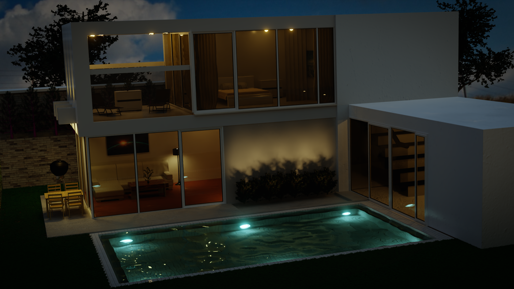
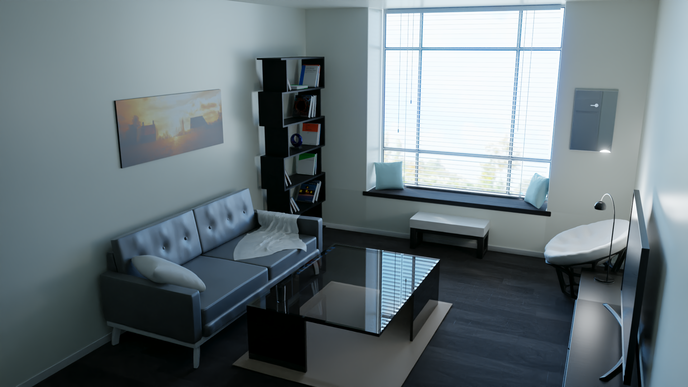

# blender-renders

Render results of blender learning projects.

Used cycles with 2000 samples for a balance between noise and render times. Also used 2.81 denoiser to clean up the images and also a bit of compositing.

